# 🍹 Modelo de Datos - Mojito Bar

## 📊 Diagrama ER Mejorado

```mermaid
erDiagram
    CLIENTE ||--o{ PEDIDO : "realiza"
    USUARIO ||--o{ PEDIDO : "atiende"
    PEDIDO ||--|{ DETALLE_PEDIDO : "contiene"
    PRODUCTO ||--o{ DETALLE_PEDIDO : "incluye"
    PRODUCTO ||--o{ DETALLE_PRODUCTO_INVENTARIO : "requiere"
    INVENTARIO ||--o{ DETALLE_PRODUCTO_INVENTARIO : "usado_en"
    
    CLIENTE {
        int id PK
        string nombre
        string email UK
        string telefono
        timestamp created_at
        timestamp updated_at
    }
    
    USUARIO {
        int id PK
        string nombre
        string email UK
        string clave
        string rol "admin, mesero, bartender"
        boolean activo
        timestamp created_at
        timestamp updated_at
    }
    
    PEDIDO {
        int id PK
        int cliente_id FK
        int usuario_id FK
        string estado "pendiente, preparando, listo, entregado, cancelado"
        decimal total
        timestamp fecha_hora
        timestamp created_at
        timestamp updated_at
    }
    
    DETALLE_PEDIDO {
        int id PK
        int pedido_id FK
        int producto_id FK
        int cantidad
        decimal precio_unitario
        decimal subtotal
        timestamp created_at
    }
    
    PRODUCTO {
        int id PK
        string nombre "Mojito, Piscola, etc"
        decimal precio
        string categoria "Cocteles, Tragos Largos"
        boolean disponibilidad
        int tiempo_preparacion_estimado
        text descripcion
        string imagen_url
        timestamp created_at
        timestamp updated_at
    }
    
    INVENTARIO {
        int id PK
        string nombre "Ron, Coca-Cola, Limón, etc"
        decimal cantidad_disponible
        string unidad "ml, gramos, unidades"
        string tipo "Licor, Refresco, Fruta"
        decimal stock_minimo
        timestamp created_at
        timestamp updated_at
    }
    
    DETALLE_PRODUCTO_INVENTARIO {
        int id PK
        int producto_id FK
        int inventario_id FK
        decimal cantidad_necesaria "Receta"
        timestamp created_at
    }
```



## 📋 Descripción de Tablas

### 1. **CLIENTE** 
👤 Clientes que compran en el bar
- Email único para identificación
- Información de contacto

### 2. **USUARIO**
👨‍💼 Personal del bar (administrador, meseros, bartenders)
- Roles: `admin`, `mesero`, `bartender`
- Control de acceso al sistema

### 3. **PRODUCTO**
🍹 Tragos/bebidas que se venden
- **Ejemplos**: Mojito, Piscola, Ron Cola, Destornillador
- Precio, categoría, tiempo de preparación
- Disponibilidad (si se puede vender o no)

### 4. **INVENTARIO**
📦 Ingredientes para preparar los tragos
- **Ejemplos**: Ron Blanco, Coca-Cola, Limón, Menta, Hielo
- Control de stock con niveles mínimos
- Unidades de medida (ml, gramos, unidades, hojas)

### 5. **DETALLE_PRODUCTO_INVENTARIO**
📝 Receta de cada producto
- Define qué ingredientes necesita cada trago
- Cantidad necesaria por unidad
- **Ejemplo**: Mojito necesita 50ml Ron + 10 hojas Menta + 1 Limón...

### 6. **PEDIDO**
🧾 Órdenes de los clientes
- Estados: `pendiente` → `preparando` → `listo` → `entregado` / `cancelado`
- Total del pedido

### 7. **DETALLE_PEDIDO**
📄 Productos específicos de cada pedido
- Cantidad de cada trago
- Precio al momento del pedido

## 🔍 Consultas Útiles

### Ver todos los productos (tragos) con precios
```sql
SELECT 
    id,
    nombre,
    precio,
    categoria,
    CASE WHEN disponibilidad THEN 'Disponible' ELSE 'No disponible' END as estado
FROM producto
ORDER BY categoria, nombre;
```

### Ver receta de un producto (ej: Mojito)
```sql
SELECT 
    p.nombre as producto,
    i.nombre as ingrediente,
    dpi.cantidad_necesaria,
    i.unidad,
    i.cantidad_disponible as disponible_en_stock
FROM producto p
JOIN detalle_producto_inventario dpi ON p.id = dpi.producto_id
JOIN inventario i ON dpi.inventario_id = i.id
WHERE p.nombre = 'Mojito'
ORDER BY i.nombre;
```

### Ver todos los pedidos del día
```sql
SELECT 
    p.id,
    c.nombre as cliente,
    u.nombre as atendido_por,
    p.estado,
    p.total,
    p.fecha_hora
FROM pedido p
LEFT JOIN cliente c ON p.cliente_id = c.id
JOIN usuario u ON p.usuario_id = u.id
WHERE DATE(p.fecha_hora) = CURRENT_DATE
ORDER BY p.fecha_hora DESC;
```

### Ver detalle de un pedido específico
```sql
SELECT 
    p.id as pedido_id,
    c.nombre as cliente,
    prod.nombre as producto,
    dp.cantidad,
    dp.precio_unitario,
    dp.subtotal
FROM pedido p
LEFT JOIN cliente c ON p.cliente_id = c.id
JOIN detalle_pedido dp ON p.id = dp.pedido_id
JOIN producto prod ON dp.producto_id = prod.id
WHERE p.id = 1;
```

### Inventario bajo stock (necesita reabastecimiento)
```sql
SELECT * FROM vista_inventario_bajo_stock;
```

O manualmente:
```sql
SELECT 
    nombre,
    cantidad_disponible,
    unidad,
    stock_minimo,
    tipo,
    ubicacion
FROM inventario
WHERE cantidad_disponible < stock_minimo
ORDER BY cantidad_disponible ASC;
```

### Productos más vendidos
```sql
SELECT 
    p.nombre,
    p.categoria,
    SUM(dp.cantidad) as total_vendido,
    COUNT(DISTINCT dp.pedido_id) as num_pedidos
FROM producto p
JOIN detalle_pedido dp ON p.id = dp.producto_id
GROUP BY p.id, p.nombre, p.categoria
ORDER BY total_vendido DESC
LIMIT 10;
```

### Verificar si se puede preparar un producto (inventario suficiente)
```sql
-- Para el Mojito (producto_id = 1)
SELECT 
    p.nombre as producto,
    i.nombre as ingrediente,
    dpi.cantidad_necesaria as necesita,
    i.cantidad_disponible as disponible,
    i.unidad,
    CASE 
        WHEN i.cantidad_disponible >= dpi.cantidad_necesaria 
        THEN 'OK' 
        ELSE 'FALTA' 
    END as estado
FROM producto p
JOIN detalle_producto_inventario dpi ON p.id = dpi.producto_id
JOIN inventario i ON dpi.inventario_id = i.id
WHERE p.id = 1;
```

### Calcular cuántos productos se pueden hacer con el inventario actual
```sql
SELECT 
    p.nombre,
    MIN(FLOOR(i.cantidad_disponible / dpi.cantidad_necesaria)) as max_unidades_posibles
FROM producto p
JOIN detalle_producto_inventario dpi ON p.id = dpi.producto_id
JOIN inventario i ON dpi.inventario_id = i.id
GROUP BY p.id, p.nombre
ORDER BY max_unidades_posibles ASC;
```

### Ventas totales por usuario (mesero/bartender)
```sql
SELECT 
    u.nombre,
    u.rol,
    COUNT(p.id) as total_pedidos,
    SUM(p.total) as total_ventas
FROM usuario u
LEFT JOIN pedido p ON u.id = p.usuario_id
GROUP BY u.id, u.nombre, u.rol
ORDER BY total_ventas DESC;
```

### Pedidos por estado
```sql
SELECT 
    estado,
    COUNT(*) as cantidad,
    SUM(total) as monto_total
FROM pedido
GROUP BY estado
ORDER BY 
    CASE estado
        WHEN 'pendiente' THEN 1
        WHEN 'preparando' THEN 2
        WHEN 'listo' THEN 3
        WHEN 'entregado' THEN 4
        WHEN 'cancelado' THEN 5
    END;
```

## 🎯 Vistas Predefinidas

### 1. `vista_recetas`
Muestra todos los productos con sus ingredientes completos.

```sql
SELECT * FROM vista_recetas WHERE producto = 'Mojito';
```

### 2. `vista_inventario_bajo_stock`
Ingredientes que están bajo el nivel mínimo.

```sql
SELECT * FROM vista_inventario_bajo_stock;
```

### 3. `vista_resumen_pedidos`
Resumen de todos los pedidos con información clave.

```sql
SELECT * FROM vista_resumen_pedidos LIMIT 10;
```

## 🔧 Operaciones Comunes

### Crear un nuevo pedido completo

```sql
-- 1. Crear el pedido
INSERT INTO pedido (cliente_id, usuario_id, estado, total)
VALUES (
    1,  -- ID del cliente
    2,  -- ID del usuario (mesero)
    'pendiente',
    13000
)
RETURNING id;

-- 2. Agregar productos al pedido (usa el ID retornado arriba)
INSERT INTO detalle_pedido (pedido_id, producto_id, cantidad, precio_unitario, subtotal)
VALUES 
    (3, 1, 2, 6500, 13000);  -- 2 Mojitos

-- 3. Actualizar total del pedido
UPDATE pedido 
SET total = (
    SELECT SUM(subtotal) FROM detalle_pedido WHERE pedido_id = 3
)
WHERE id = 3;
```

### Actualizar inventario después de preparar un pedido

```sql
-- Reducir inventario basado en un pedido (ID = 1)
UPDATE inventario i
SET cantidad_disponible = cantidad_disponible - (
    dpi.cantidad_necesaria * dp.cantidad
)
FROM detalle_pedido dp
JOIN detalle_producto_inventario dpi ON dp.producto_id = dpi.producto_id
WHERE i.id = dpi.inventario_id
AND dp.pedido_id = 1;
```

### Cambiar estado de un pedido

```sql
UPDATE pedido 
SET estado = 'preparando' 
WHERE id = 1;
```

## 📈 Mejoras Implementadas

### ✅ Cambios respecto al modelo original:

1. **Separación clara**: Inventario ahora son ingredientes, no productos finales
2. **Recetas**: Tabla `detalle_producto_inventario` define ingredientes de cada trago
3. **Unidades de medida**: Soporte para ml, gramos, unidades, hojas, etc.
4. **Stock mínimo**: Alertas automáticas de bajo inventario
5. **Precio en detalle**: Guarda precio al momento del pedido (por si cambia después)
6. **Estados del pedido**: Flujo completo desde pendiente hasta entregado
7. **Triggers**: Actualización automática de timestamps
8. **Vistas**: Consultas comunes precalculadas
9. **Índices**: Optimización de búsquedas frecuentes

## 🎨 Datos de Ejemplo Incluidos

- ✅ 3 Usuarios (Admin, Mesero, Bartender)
- ✅ 3 Clientes
- ✅ 10 Ingredientes (Ron, Coca-Cola, Pisco, Limón, Menta, etc.)
- ✅ 7 Productos (Mojito, Piscola, Ron Cola, etc.)
- ✅ Recetas completas para 4 productos
- ✅ 2 Pedidos de ejemplo con detalles

## 🚀 Próximos Pasos Sugeridos

1. Crear módulo `pedido` con arquitectura hexagonal
2. Crear módulo `cliente` 
3. Crear módulo `usuario` con autenticación
4. Implementar lógica de descontar inventario automáticamente
5. Agregar validación de stock antes de confirmar pedido
6. Dashboard en tiempo real de pedidos activos
7. Sistema de notificaciones (WebSocket con Redis)
8. Reportes de ventas y estadísticas

---

**Base de datos:** Mojito Bar  
**Versión:** 2.0  
**Última actualización:** 23 Nov 2025
